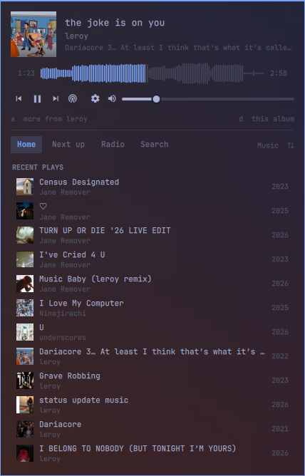
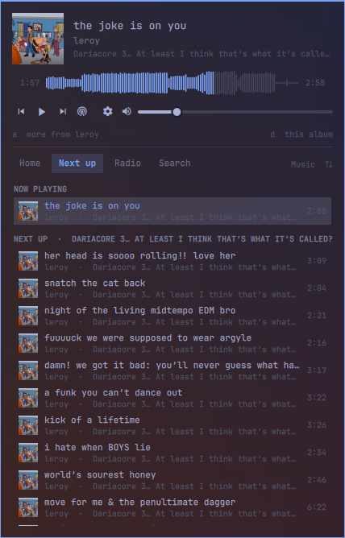
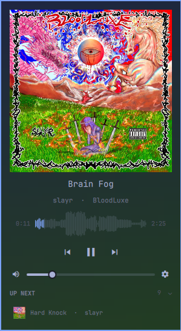
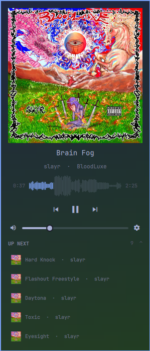
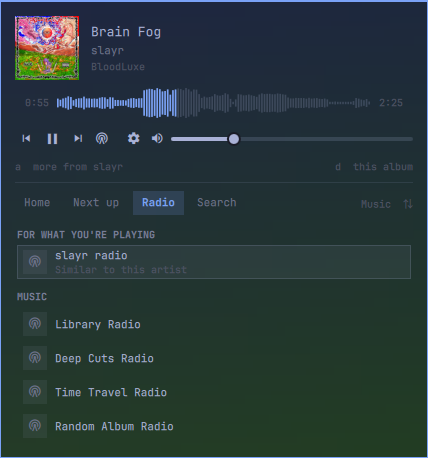

# Ampbar for Plex

An independent Plex music player that lives in the Omarchy bar. The cover of whatever is
loaded sits in the bar, dimming while paused; pressing it (or a keybind) drops
down a keyboard-driven panel with cover art, a waveform scrubber, transport
controls, and four tabs — Home, Next up, Radio and Search.

The panel takes on the colours of whatever is playing, using the same
four-corner album palette (`UltraBlurColors`) exposed by Plex, and
clicking the cover art swaps to a mini viewer: art as large as it goes, plus
seek, skip, volume and what's queued next.

The plugin *is* the player — it talks to the Plex Media Server API for your
library and stream URLs, then plays them through a headless `mpv` it controls
over an IPC socket. The official Plexamp application is not required or used.
The screenshots below are real captures of Ampbar running in Omarchy.

## Screenshots

Home — now playing and listening history:



Next up — the active queue:



Mini player — default one-track Up next preview:



Mini player — expanded Up next queue:



Radio — seeded and library stations:



## Requirements

- Omarchy 4 (`omarchy-shell`)
- `mpv`, `ffmpeg`, `curl`, `jq`, `python3`, `bash`
- A Plex account with a music library

## Install

```sh
omarchy plugin add https://github.com/kyllan/ampbar-for-plex-omarchy.git --enable
```

Omarchy clones, validates, and enables the plugin. Add the **Ampbar for Plex** widget to your bar from
the bar settings if it doesn't appear on its own.

For a local development checkout, `./install.sh` copies the current directory
to `~/.config/omarchy/plugins/io.github.kyllan.ampbar/`, validates it, rescans,
and enables it.

## Remove

```sh
omarchy plugin remove io.github.kyllan.ampbar
```

Disabling or removing the plugin stops its player automatically (normally
within one second). Sign out first if you want the credential file removed. See [Privacy](PRIVACY.md)
for the optional local-state cleanup paths.

## Sign in

Open the dropdown and press `s`. The plugin asks plex.tv for a link code, opens
your browser at plex.tv, and shows the code in the panel. Enter it, and the
plugin finds your servers, picks the best reachable connection, and starts
loading your library.

Credentials are written by `bin/plexamp-auth` to
`~/.config/omarchy/plexamp/auth.json` with mode `0600`. Nothing is written from
QML, and the token never leaves your machine except to talk to Plex.

Sign out from the settings window (`c`), with `O` (capital) in the panel, or:

```sh
~/.config/omarchy/plugins/io.github.kyllan.ampbar/bin/plexamp-auth logout
```

If your server moves (new IP, relay churn), the settings window (`c`) has a
server address field and a **Detect automatically** button. The same thing from
a shell:

```sh
~/.config/omarchy/plugins/io.github.kyllan.ampbar/bin/plexamp-auth rediscover
~/.config/omarchy/plugins/io.github.kyllan.ampbar/bin/plexamp-auth server 192.168.1.10:32400
```

A bare host gets `http://` and `:32400` filled in. The address is verified
against `/identity` before it is saved, so a typo leaves the working one alone.

## Keys

Inside the dropdown:

| Key | Action |
| --- | --- |
| `j` / `k` / `↓` / `↑` | Move the cursor |
| `l` / `→` | Open what's under the cursor (album / artist) |
| `h` / `←` | Back out one level — browse view, tab, or the mini viewer |
| `Enter` | Play what's under the cursor |
| `Space` | Play / pause — everywhere, including the mini viewer |
| `Tab` / `Shift+Tab` | Switch tab |
| `1` / `2` / `3` / `4` | Home / Next up / Radio / Search |
| `u` | Next up (the live queue) |
| `/` | Jump to the search box |
| `v` | Mini viewer (big art, minimal controls) |
| `c` | Settings window |
| `?` | Show / hide the shortcut hint line |
| `p` | Play / pause (same as `Space`) |
| `n` / `b` | Next / previous track |
| `,` / `.` | Seek 5s back / forward |
| `<` / `>` | Seek 30s back / forward |
| `+` / `-` | Volume up / down |
| `m` | Mute |
| `a` | Browse more from the current artist |
| `d` | Browse the current album |
| `R` | Start radio from the current artist |
| `L` | Switch music library (when the server has more than one) |
| `Backspace` | Like `h`, but closes the panel once there's nothing left to leave |
| `g` / `G` | Jump to top / bottom of the list |
| `r` | Reload the library |
| `s` | Sign in (when signed out) |
| `O` | Sign out |
| `Esc` | Close |

In the search box, `Enter` runs the search and moves focus to the results, `↓`
does the same without waiting, and `Esc` steps back to the list. Holding `Enter`
no longer opens whatever the cursor lands on: a Return arriving right after the
search is committed is swallowed.

`Tab` wraps around all four tabs in both directions, from inside the search box
too.

`x` is not a back key. `h` is the only one that steps back, plus `Backspace`
when you also want the panel to close at the end.

Every key means the same thing in the mini viewer as it does in the full panel:
`h` leaves it, `,` / `.` seek, `Space` toggles play, `n` / `b` skip. Reaching for
the library — a tab key, `/`, `u`, `a`, `d`, `r`, `L` — drops you back into the
full panel on its own.

The radio button dims when there's nothing to seed a station from — no artist on
the current track, and no library station to fall back on.

Mouse: left-click the bar icon toggles the panel, right-click plays/pauses,
middle-click skips. In the list, left-click plays and right-click opens. Click
the cover art for the mini viewer, and click anywhere on the waveform to seek.

## Global keybinds

The plugin exposes IPC methods you can bind anywhere in Hyprland:

```sh
omarchy-shell io.github.kyllan.ampbar toggle
omarchy-shell io.github.kyllan.ampbar playPause
omarchy-shell io.github.kyllan.ampbar next
omarchy-shell io.github.kyllan.ampbar previous
omarchy-shell io.github.kyllan.ampbar volumeUp
omarchy-shell io.github.kyllan.ampbar volumeDown
omarchy-shell io.github.kyllan.ampbar radio
omarchy-shell io.github.kyllan.ampbar mini
omarchy-shell io.github.kyllan.ampbar status
```

`omarchy-shell <target> <method>` addresses the plugin's own IPC handler. The
`omarchy-shell shell toggle <id> '{}'` form works too, but only for `toggle`.

`install.sh` does not touch your Hyprland config. These are the bindings this
plugin was set up with — add them to `~/.config/hypr/bindings.lua` yourself:

```lua
hl.unbind("SUPER + SHIFT + M")  -- Omarchy binds this to Spotify
o.bind("SUPER + SHIFT + M", "Ampbar for Plex", "omarchy-shell io.github.kyllan.ampbar toggle")
o.bind("SUPER + ALT + P", "Ampbar play/pause", "omarchy-shell io.github.kyllan.ampbar playPause")
o.bind("SUPER + ALT + N", "Ampbar next track", "omarchy-shell io.github.kyllan.ampbar next")
o.bind("SUPER + ALT + B", "Ampbar previous track", "omarchy-shell io.github.kyllan.ampbar previous")
```

The `XF86Audio*` media keys are deliberately left alone: Omarchy already routes
them to MPRIS, and taking them would break media control in your browser.

## Settings

Press `c` (or the gear in the transport row) for a floating settings window —
its own layer-shell surface, not another page of the dropdown. `j` / `k` move,
`Enter` changes, `Esc` closes. It covers:

- **Server address** — type an IP or host to pin the plugin to one connection,
  or **Detect automatically** to re-probe. Only `bin/plexamp-auth` ever touches
  the credentials file.
- **Show keyboard shortcuts** — the hint line along the bottom of the panel.
  `?` toggles it too.
- **Album cover in the bar** — off falls back to the animated sound bars.
- **Hide the widget when idle** — off by default, so the widget is always there
  as a launcher.
- **Show one next-up track in the mini viewer** — off starts with no preview;
  the **Up next** header always expands the list when you want more.
- **Sign out of Plex**.

The same options (plus **History entries to load**, how deep the Home tab's
history goes) are in the bar widget settings. The settings window writes to the
plugin's own state file, which wins over the shell.json entry — a plugin can't
safely rewrite the shell config from underneath the shell.

Volume, the chosen music library, and these preferences are remembered in
`~/.local/state/omarchy/plexamp/state.json`.

## Tabs

- **Home** — five most-played albums (with radio/single fallbacks) from this
  month, five recently added albums, then your listening history.
- **Next up** — the live queue: what's playing, then everything after it.
  `Enter` on a row jumps straight to it and keeps the rest of the queue.
- **Radio** — the stations Plex generates for the library, plus a station seeded
  from whatever is playing.
- **Search** — artists, albums and tracks, searched as you type.

Selecting an artist gives you their albums first, then singles & EPs, then
anything else they turn up on.

## Gapless

mpv is kept holding a two-entry playlist: whatever is playing, plus the track
after it. With `--prefetch-playlist` mpv opens and buffers that second stream
while the first is still going, so a track change is a playlist step rather than
a fresh network open — and pressing `n` skips through the same prefetched entry.
`playlist-pos` is what tells the plugin the change happened; a guard timer falls
back to loading the track the ordinary way if mpv never moves.

The next track's waveform is analysed on the same schedule, so the timeline is
drawn the moment the track starts instead of a second into it.

## Shell refreshes

The mpv player runs under a supervisor in a separate session from the
reloadable Quickshell service. A shell or plugin refresh therefore leaves audio
and mpv's current timestamp alone; when the service returns, it reconnects to
mpv and restores the queue description from its state file. Refreshing the
shell will still close the panel itself, but it should not restart the song.

The supervisor watches the plugin's source directory and enabled entry in
Omarchy's `shell.json`. Disabling or removing the plugin shuts down mpv. A
temporarily unreadable shell configuration gets five seconds to recover before
the player stops.

## The waveform

Your server exposes no loudness ramps (that needs Plex's own sonic analysis), so
`bin/plexamp-waveform` builds the envelope itself: it decodes the track with
`ffmpeg` at a low sample rate and reduces it to 120 RMS buckets. A four-minute
FLAC takes well under a second over a LAN, it runs at `nice 19` after playback
has already started, and every result is cached by rating key under
`~/.local/state/omarchy/plexamp/waveform/` and again in memory, so a track is
analysed once and never again. Tracks it can't read fall back to a plain progress line.

## Layout

| File | Role |
| --- | --- |
| `manifest.json` | Plugin manifest (`service` + `bar-widget`) |
| `Service.qml` | Plex session, library queries, play queue, mpv IPC |
| `Panel.qml` | Bar button and the keyboard-driven dropdown |
| `PlexApi.js` | Pure URL-building and response-parsing helpers |
| `PlexSettings.qml` | The floating settings window (its own layer surface) |
| `PlexPanel.qml` | Vendored `Ui/KeyboardPanel` with a tintable card background |
| `SeekBar.qml` | Elapsed / waveform / remaining, with a plain-bar fallback |
| `Waveform.qml` | The mirrored envelope itself, drawn on two clipped canvases |
| `AmpIcon.qml` | Original equalizer mark used when no album art is loaded |
| `SoundBars.qml` | Animated playing indicator, and the bar's art fallback |
| `bin/plexamp-auth` | plex.tv PIN sign-in and server discovery |
| `bin/plexamp-engine` | mpv supervisor that survives reloads and stops on removal |
| `bin/plexamp-waveform` | ffmpeg loudness envelope, cached per track |

`PlexPanel.qml` is a copy of Omarchy's `Ui/KeyboardPanel` with one change — the
card's fill is a property instead of a hard-coded theme colour, which is what
lets the album palette reach the panel's edges. Re-sync it if that file changes
upstream.

## Development

`./install.sh` copies the checkout into the plugin directory, validates it, and
enables it. The tests under `tests/` use private temporary directories, a fake
Plex server, silent audio, and never touch the running desktop:

```sh
python3 -m unittest discover -s tests -v
```

The fresh-install smoke test drives the real Service in an offscreen Quickshell
against a real mpv, so it needs Omarchy, Quickshell, mpv, ffmpeg, curl, and jq.

## Security and privacy

This plugin runs as unsandboxed code inside Omarchy's shell and launches local
helpers. It requires `mpv`, `ffmpeg`, `curl`, `jq`, `python3`, `bash`, and
standard Linux utilities; it never uses `sudo` or installs packages. It contacts Plex only for
PIN sign-in/server discovery and the Plex Media Server selected by the user.
Its mpv IPC socket is restricted to the per-user `$XDG_RUNTIME_DIR`, not `/tmp`.
The state directory is mode `0700`; saved queues contain rating keys only, and
the waveform helper uses a mode-`0600` temporary curl config so token-bearing
stream URLs never appear in process arguments. See [PRIVACY.md](PRIVACY.md) for
the full token, stream-URL, and local-state details.

## License, Plex, and attribution

Except for the vendored Omarchy component described in
[THIRD_PARTY_NOTICES.md](THIRD_PARTY_NOTICES.md), this code is dedicated to the
public domain under [CC0-1.0](LICENSE); reuse and attribution are optional.

Plex, Plex Media Server, and Plexamp are trademarks of Plex, Inc. Plex is used
under license from Plex. Ampbar for Plex is independent and is not affiliated
with or endorsed by Plex. This code license does not grant rights to Plex
trademarks, Plex services, library artwork, or music; use of the integration is
subject to Plex's terms and to the rights covering the user's media.
